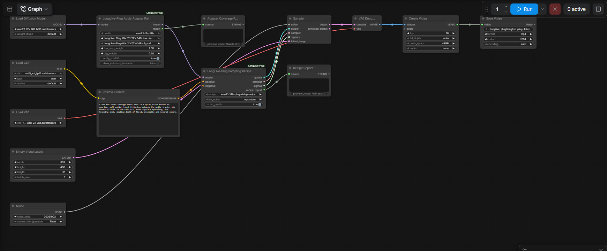

# ComfyUI-LongLive-Plug

Unofficial community integration of [NVlabs LongLive-Plug](https://github.com/NVlabs/LongLive/tree/main/LongLive-Plug)
adapters for ComfyUI's built-in Wan2.1 support. Not affiliated with or
endorsed by NVIDIA, the Wan team or Comfy Org.

日本語の概要: [README.ja.md](README.ja.md)

LongLive-Plug distils CFG and few-step sampling into two LoRAs per backbone.
Using them correctly takes more than loading two LoRAs and setting
`steps=4`. You need both adapters at the right weights (Few-Step 1.0, CFG 0.5),
every adapter target applied, a runtime CFG scale of 1.0 with
conditional-only passes, and the scheduler the adapters were distilled for.
This package does those parts and reports what it did:

- **LongLive-Plug Apply Adapter Pair**: applies the official Few-Step + CFG
  LoRAs to a matching Wan backbone. It checks backbone shape, PEFT/native
  key mapping, A/B direction, rank and alpha (from file metadata,
  `adapter_config.json` or the pinned release hash), finiteness and
  unused keys. It patches a clone and returns a JSON coverage report
  (400/400 targets per adapter on Wan2.1-T2V-14B). Quantized bases are
  refused.
- **LongLive-Plug Sampling Recipe**: outputs the `GUIDER`, `SAMPLER` and
  `SIGMAS` of an upstream-verified recipe for ComfyUI's `SamplerCustomAdvanced`.
  The default is the LongLive-Plug 4-step FlowUniPC recipe, a
  re-implementation that is bit-identical on CPU to the upstream scheduler,
  including int64-truncated model timesteps and the `x_T = noise` start. The
  official Wan2.1 50-step baseline is included for comparisons.

Everything else uses ComfyUI core nodes.


Full-resolution MP4s (832×480, 81 frames, 16 fps) and the run manifest are
attached to the [v0.1.0 release](https://github.com/hiroki-abe-58/ComfyUI-LongLive-Plug/releases/tag/v0.1.0).
The images above are reduced previews of those files.

## Status

| | Scope |
| --- | --- |
| **Tested** (real generation) | Wan2.1-T2V-14B, unquantized bf16 file from Comfy-Org's repackage, with the official LongLive-Plug Wan2.1-T2V-14B Few-Step + CFG LoRAs. ComfyUI v0.38.0, Windows 11, RTX 5090 32 GB, PyTorch 2.14.1+cu130, Python 3.12, ComfyUI started with `--bf16-unet --bf16-text-enc --fp32-vae`. All three 4-step recipes and the 50-step baseline ran at 832×480×81. |
| **Tested** (model-free CI) | Ubuntu and Windows, CPU: node registration through ComfyUI's loader, adapter validation, patch/unpatch on a tiny Wan-shaped model, sampler pass counts, workflow validation with ComfyUI's `validate_prompt`. |
| **Experimental** | ComfyUI's default automatic dtypes (fp16 DiT on this GPU): one 17-frame smoke run only. `allow_untested_derivative` for other Wan2.1-14B family models (e.g. I2V, VACE): shape-checked, never run. |
| **Untested** | Linux / other GPUs with real weights, fp16 base files, other resolutions and lengths, macOS. |
| **Not supported** | Quantized bases: refused, because their patch path is not verified. Checked with Comfy-Org's `wan2.1_t2v_14B_fp8_scaled` (refused); tensor subclasses such as ComfyUI's `QuantizedTensor` are refused by class; other quantized formats were not tried. Mixing backbones (1.3B, Wan2.2-5B or MiniMax-H3 adapters on 14B): refused by the target/shape checks. |
| **Planned** | Wan2.2-TI2V-5B profile (separate backbone and adapters); MiniMax-H3 after its model card is re-checked. The long-context LoRA is not a few-step feature and is out of scope here. |

## Install

```bash
cd ComfyUI/custom_nodes
git clone https://github.com/hiroki-abe-58/ComfyUI-LongLive-Plug
```

There are no extra Python dependencies. Model files, pinned revisions and
SHA-256 are listed in [docs/REPRODUCE.md](docs/REPRODUCE.md). In short:

| Folder | File (as used by the workflows) | Source (pinned revision) |
| --- | --- | --- |
| `diffusion_models` | `wan2.1_t2v_14B_bf16.safetensors` | Comfy-Org/Wan_2.1_ComfyUI_repackaged @ `123acf1` |
| `text_encoders` | `umt5_xxl_fp16.safetensors` | same |
| `vae` | `wan_2.1_vae.safetensors` | same |
| `loras` | `LongLive-Plug-Wan2.1-T2V-14B-few-step.safetensors` | Efficient-Large-Model/LongLive-Plug-Wan2.1-T2V-14B-few-step @ `f125af0` (`generator_lora_lightx2v.safetensors`, renamed) |
| `loras` | `LongLive-Plug-Wan2.1-T2V-14B-cfg.safetensors` | Efficient-Large-Model/LongLive-Plug-Wan2.1-T2V-14B-cfg @ `32b8aa3` (`adapter_model.safetensors`, renamed) |

Start ComfyUI with `--bf16-unet --bf16-text-enc --fp32-vae` to match upstream
precisions. Without the flags ComfyUI v0.38.0 chose fp16 for the DiT and text
encoder and bf16 for the VAE on the test machine (see [docs/SCHEDULER.md](docs/SCHEDULER.md)).

## Workflows

| File | What it runs |
| --- | --- |
| `workflows/wan21_t2v_14b_longlive_plug_4step.json` | Adapter pair (1.0 / 0.5) + 4-step FlowUniPC, CFG 1 |
| `workflows/wan21_t2v_14b_baseline_50step.json` | Base model, official 50-step UniPC, CFG 5, Wan's default negative prompt |
| `workflows/api/*.json` | The same graphs in API format |



The GUI files were produced from the API files with ComfyUI's own frontend.
The export script checks that converting them back yields the API prompt
exactly. Node types: `UNETLoader`, `CLIPLoader`, `VAELoader`, `CLIPTextEncode`,
`EmptyHunyuanLatentVideo`, `RandomNoise`, `SamplerCustomAdvanced`,
`VAEDecode`, `CreateVideo`, `SaveVideo`, `PreviewAny` (ComfyUI core) plus the
two nodes of this package. The recipe and coverage reports appear in the two
`PreviewAny` nodes.

Recipes (`LongLive-Plug Sampling Recipe` → `recipe`):

| Recipe | Source | Model passes |
| --- | --- | --- |
| `wan21-14b-plug-4step-unipc` (default) | LongLive-Plug `inference.py` + `configs/wan21_dmd.yaml` | 4 (cond only) |
| `wan21-14b-plug-4step-euler` | Few-step adapter's `inference_config.json` (LightX2V step list) | 4 (cond only) |
| `wan21-14b-plug-4step-lcm` | Few-step adapter's training rollout (Self-Forcing-Plus) | 4 (cond only) |
| `wan21-14b-base-50step-unipc-cfg5` | Wan2.1 `generate.py` defaults | 100 |
| `wan21-14b-base-4step-unipc-cfg5-naive` | not upstream; comparison only | 8 |

Why there are three 4-step recipes, and what exactly was verified, is in
[docs/SCHEDULER.md](docs/SCHEDULER.md).

## Demo and benchmark

Prompt (written for this demo): *"A red fox trots through fresh snow in a quiet
birch forest at sunrise, soft golden light filtering between the white
trunks, its breath visible in the cold air, snow crystals sparkling, low
tracking shot, shallow depth of field, cinematic and natural colors."*
Seed 20261002, 832×480, 81 frames, 16 fps, single RTX 5090 (32 GB), same
ComfyUI session settings as in "Status". All numbers below were measured for
this README; methodology and raw data are in [docs/BENCHMARKS.md](docs/BENCHMARKS.md).

| Run | Model passes | Sampler stage | End-to-end wall time |
| --- | --- | --- | --- |
| B LongLive-Plug 4-step, first run after server start | 4 | 41.3 s | 59.0 s |
| B LongLive-Plug 4-step, second run (seed+1, loaders cached) | 4 | 37.8 s | 44.5 s |
| A base 50-step CFG 5, first run after server start | 100 | 932.2 s | 943.5 s |
| A base 50-step CFG 5, after B in the same session | 100 | 933.6 s | 943.0 s |
| C base naive 4-step CFG 5 (comparison) | 8 | 78.2 s | 84.9 s |

- "Sampler stage" includes moving weights to the GPU and LoRA patching,
  because ComfyUI's DynamicVRAM loads weights lazily during the first step.
  It is not pure denoising time. Warm per-step time was about 9.3 s for B
  (batch 1) and about 18.5 s for A (cond and uncond batched).
- "First run after server start" was not a cold-disk run: the OS file cache
  was not flushed.
- VRAM: nvidia-smi showed up to about 30–31 GiB used on the device (all
  processes; about 2.4 GiB was used by other applications before the runs).
  DynamicVRAM fills free VRAM by design, so this is not a minimum requirement.
  PyTorch allocator peaks were 6.0–6.1 GiB allocated / 7.9–9.1 GiB reserved;
  the model weights are managed outside that allocator. The minimum VRAM and
  host RAM needed were not measured. The machine has 64 GB RAM.
- Quality (visual review of five extracted frames per video): B keeps the
  subject, scene and motion of the prompt over all 81 frames. It is sharper
  and more contrasted/saturated than A, with more stylised bark texture.
  A looks more natural. C (step reduction without adapters) is blurred and
  ghosted. The outputs differ in composition because the samplers differ;
  they are not expected to match pixel for pixel.

## Limitations and known issues

- Only Wan2.1-T2V-14B is profiled. Other backbones are refused rather than guessed.
- ComfyUI's `RandomNoise` uses a different noise layout than the upstream CLI,
  so the same seed does not reproduce upstream videos. The *sampling
  arithmetic* matches (docs/SCHEDULER.md).
- The coverage report proves that ComfyUI attached every patch. On real
  weights the patched values were compared with upstream `merge_lora.py` on
  CPU for 7 representative layers (bit-identical). In the server ComfyUI
  performs the same float32 arithmetic on the device where it stages the
  weights, so float32 rounding can differ slightly from the CPU check.
- The SHA-256 check reads each adapter once per ComfyUI session (about 3.6 GB).
  With `verify_sha256` disabled, the CFG adapter's alpha must come from
  `adapter_config.json`, which is only read next to a file named
  `adapter_model.safetensors`. A renamed CFG adapter is then refused rather
  than applied with a guessed alpha.

## Security

The nodes read safetensors from ComfyUI's model folders and patch a model
clone in memory. They spawn no processes, make no network requests and
install nothing. The optional benchmark probe and scripts are described in
[docs/SECURITY.md](docs/SECURITY.md).

## Development

```bash
python -m pytest -q        # COMFYUI_PATH=<ComfyUI v0.38.0 checkout> for the ComfyUI-backed tests
python -m ruff check . && python -m ruff format --check .
```

Tests marked `comfy` fail (they do not skip) when `COMFYUI_PATH` is missing.
CI runs everything on Ubuntu and Windows without model weights.

The Comfy Registry package contains the node, the workflows and the docs.
Tests, maintainer scripts and the benchmark probe are excluded via
`.comfyignore` and are only in this repository.

## License

Apache-2.0 for this repository. Upstream code, adapters and models keep their
own terms. See [docs/LICENSING.md](docs/LICENSING.md) for the per-component
breakdown and attributions, and `NOTICE`.

## Roadmap

- Wan2.2-TI2V-5B profile and recipes (separate backbone, separate adapters, verified the same way).
- MiniMax-H3, after re-checking its model card. Few-Step and CFG use together is not assumed.
- Registry metadata is prepared in `pyproject.toml`; publishing to the Comfy Registry is not part of v0.1.0.

## Citation

LongLive-Plug: Shuai Yang, Luozhou Wang, Wei Huang, ZhiFei Chen, Bohan Zhang,
Xiao Fu, Qianli Ma, Chen-Hsuan Lin, Weian Mao, Bryan Chu, Song Han, Yukang Chen.
*LongLive-Plug: Once-for-All Distillation for Video Generation*, 2026.
